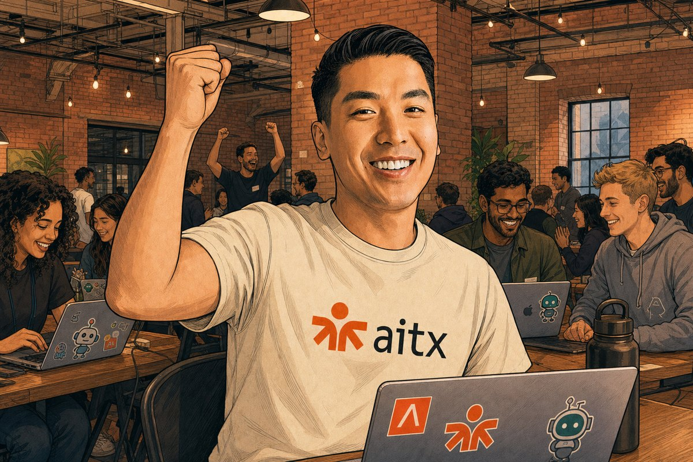
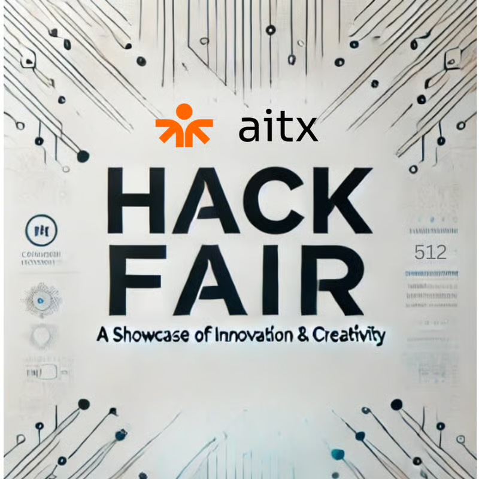
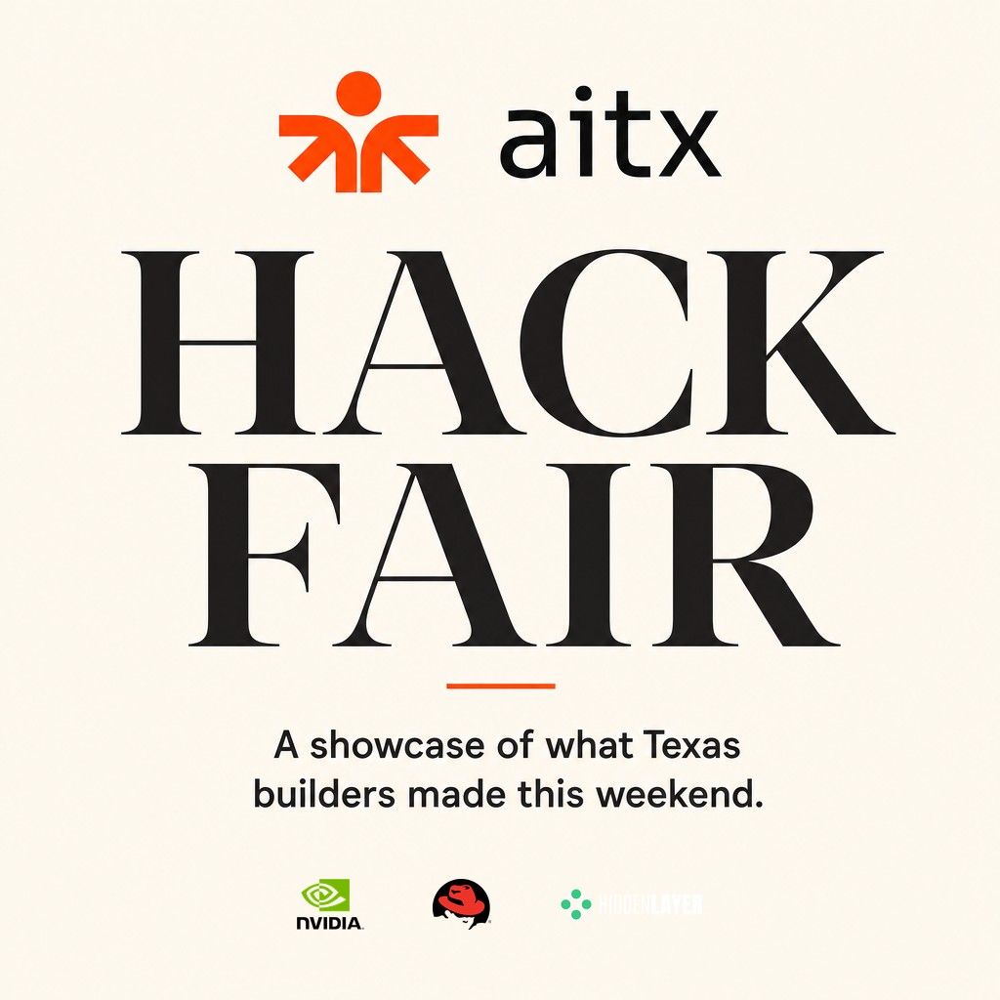
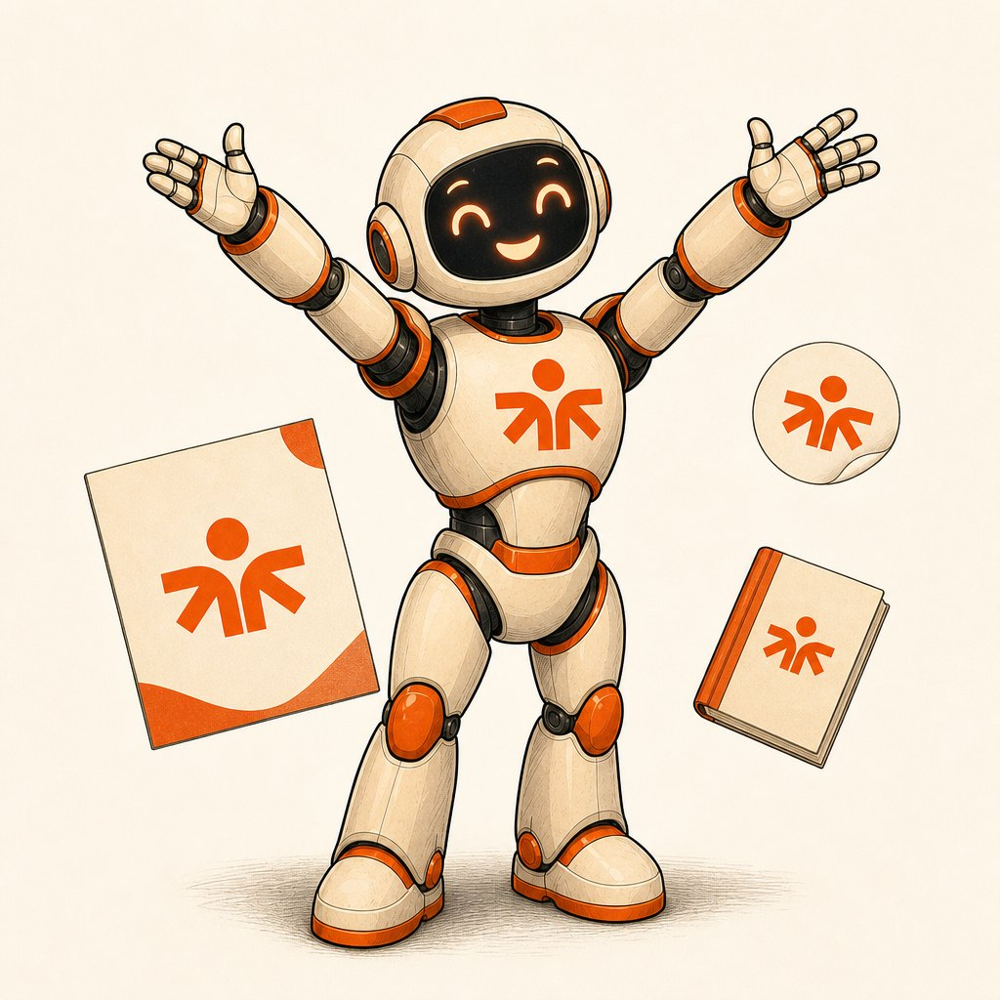

# Agentic Brand Universe

### AITX × NVIDIA Claw Agent Hackathon submission

> **A version-controlled home for a brand, with an agent (Chip, the brand czar) that learns its voice and never breaks it.** Powered by **NVIDIA Nemotron via NIM**, Chip generates anything on-brand *and gets sharper the more it runs*: it critiques its own output against the brand's rules, and when it slips it writes itself a new rule and remembers it. No model retraining. Every asset carries full provenance, so nothing is a mystery and everything is reproducible.

**Track:** Recursive Intelligence · **Bounties:** Best Use of Nemotron · Most Commercializable (Antler)

## ▶ Start here: [aitx-brand-os.vercel.app/keynote](https://aitx-brand-os.vercel.app/keynote)

A ~5-minute keynote, co-presented by me and Chip (in his own voice), built entirely from the AITX brand universe.



---

### The whole idea, in one picture

Same event graphic. On the left: raw AI, no system — garbled text, stock clip-art, un-branded, unrepeatable. On the right: the same thing made by Chip from the AITX universe — on brand, correct, reproducible, sponsors and all.

| Without a brand universe | With the Agentic Brand Universe |
|:---:|:---:|
|  |  |

---

### Meet Chip, the brand czar



Chip holds the canon, the blessed "goldens," and the rules. Michael and Jake don't call me for assets anymore — they talk to Chip. He does the making; they stay in charge of taste.

---

### See it live

- 🎤 **[The keynote](https://aitx-brand-os.vercel.app/keynote)** — start here. The full argument, co-presented by Gary + Chip.
- 🤖 **[The learning agent](https://aitx-brand-os.vercel.app/agent)** — give it a task, watch it slip off-brand, teach it once, watch it fix itself. Real Nemotron, live.
- 💼 **[The platform / business](https://aitx-brand-os.vercel.app/platform)** — GitHub for brand universes.
- 💌 **[On-brand sponsor thank-yous](https://aitx-brand-os.vercel.app/thanks)** — Chip writes them; you record them in your voice.
- 📖 **Proof — books Chip made in ~30 min each:** [Show Up (Michael)](https://show-up-book.vercel.app) · [Do All The Things (Mark Heaps of NVIDIA)](https://do-all-the-things-book.vercel.app) · [AITX origin story](https://aitx-origin.vercel.app)

### Where the Nemotron code lives

| Path | What |
|---|---|
| `portal/app/api/agent/route.ts` | Nemotron (NIM) generation + self-critique + the learning step |
| `portal/lib/agent/` | the deterministic brand-rule critic (the metric) + the knowledge base |
| `hackathon/brand-agent/` | the CLI + the measured recursive-intelligence delta (`demo.py`) + full writeup |
| `generator/` | the provenance spine — every asset ↔ its exact recipe |
| `hackathon/SUBMISSION.md` | the hackathon submission answers |

### Run the demo yourself

```bash
# the measured recursive-intelligence delta, on real Nemotron
cd hackathon/brand-agent
echo "NIM_API_KEY=nvapi-..." > .env      # free key at build.nvidia.com
uv run demo.py                            # or: uv run demo.py --mock  (no key)

# the web app (keynote + live agent)
cd portal && npm install && npm run dev   # http://localhost:3000/keynote
```

---

# AITX — a story universe

> **The vision:** [`VISION.md`](VISION.md) — AITX as an agentic story OS: one version-controlled, human/machine/partner-legible brand source of truth, editable in plain language.

Michael Daigler's AITX universe, built on the [Agentic Story](../agenticstory) framework (spec v0.2). The **universe is the first-class object**: a typed, git-versioned canon (`universe/`) where every reference is load-bearing. Books, flyers, speaker cards, and any other projection are queries over this canon that write back into it.

## Canon so far (incremental)

- **`aitx`** (group) — the community: largest AI builder community in Texas, warm/human/bold, exact palette `#ff4201 / #010101 / #ffffff`.
- **`michael-daigler`** (character · realPerson) — founder. Locked: master + face macro + poses + back turnaround (tee back = Texas + "Texas loves AI"). Stays **gated** on his blessing for any property.
- **`jake-oshea`** (character · realPerson) — cofounder, a foot taller. Locked: default VC quarter-zip wardrobe (plain back) + casual tee alternate; face + poses + back.
- **`founders`** — the locked two-shot (correct one-foot height gap), the anchor for any scene with both.
- **`aitx-mark`** (motif) — the sacred logo; load-bearing on every render (`reference/aitx-mark/aitx-logo.png`).
- **`antler-venue`** (setting · LOCKED), **`aitx-skylark`** + **`aitx-merch`** (props).
- **`origin-of-aitx`** (story · full) — the first property, spine `testimony`.

## Properties (molecules)

- **`books/origin-of-aitx/`** — *The Origin of the AITX Community*, a narrated flip-book (13 spreads + cover + closing). Live: **https://aitx-origin.vercel.app** (Vercel project `aitx-origin`, git-linked; `git push` auto-deploys).
- **`goldens/`** — the blessed base-asset library (flyers, IG post, memes, stickers). See `goldens/README.md` for the atoms→molecules brand-OS vision.

## Working with it

From the engine (`../agenticstory/engine`), pointed at `universe/`:

```bash
U=../../aitx/universe
python3 -m agenticstory.cli validate     "$U"     # structural check (green)
python3 -m agenticstory.cli list         "$U"     # the canon
python3 -m agenticstory.cli assert-spread "$U" --characters michael-daigler
#   -> refuses until michael's real GABR art exists (the load-bearing gate)
```

## How it grows (the incremental loop)

1. Add a canon entity or relation (a new person, setting, motif, doctrine) as a typed record; keep `validate` green.
2. Register a property as a `stub` (title + spine), then promote to `full` (features + beats + per-beat provenance + register) when it is real.
3. Lock references (art, photos, the register anchor); the gate refuses to render until they exist.
4. A finished property **writes back** new/updated canon. Every change is a commit; the diff is the changelog.

Real-subject rule: any property featuring Michael stays gated until he blesses the words and the art.
